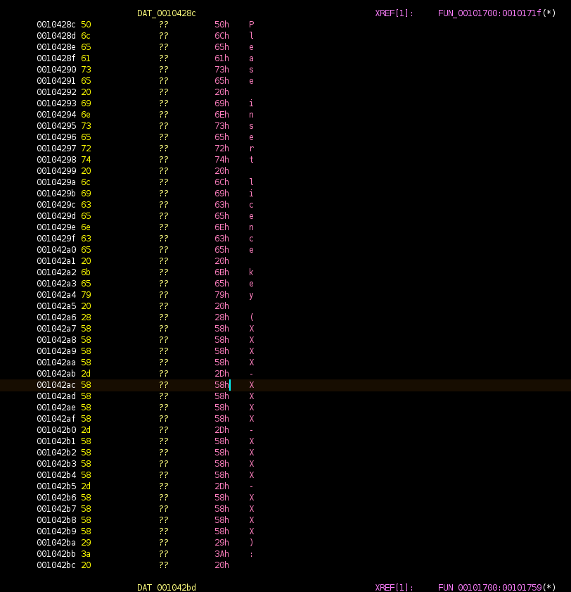
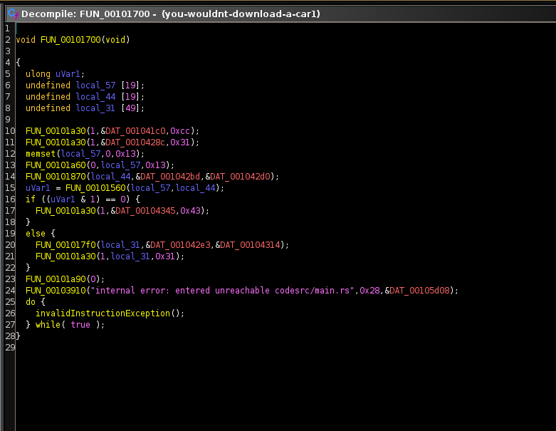
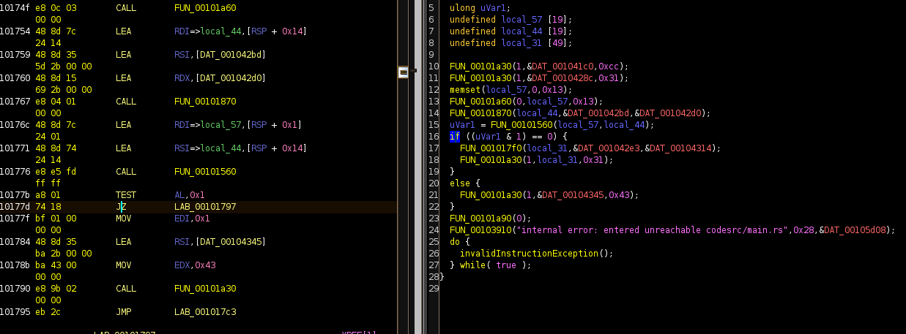

> # Rev - You wouldn't download a car
> > Rev - 200 pts
>
> You wouldn't steal a car <br>
> You wouldn't steal a handbag <br>
> You wouldn't steal a television <br>
> You wouldn't steal a movie <br>
>
> Downloading pirated films is stealing, <br>
> stealing is against the law, <br>
> PIRACY. IT'S A CRIME <br>
>
> [This](./you-wouldnt-download-a-car) is a really good piece of software. You have to pay for it.

## Writeup

When we download the binary we can see that it is an ELF 64-bit file.

Running `strings` on the file does not reveal much, and running the binary itself we see that it wants a license key
```bash
$ ./you-wouldnt-download-a-car
You wouldn't steal a car
You wouldn't steal a handbag
You wouldn't steal a television
You wouldn't steal a movie

Downloading pirated films is stealing,
stealing is against the law,
PIRACY. IT'S A CRIME

Please insert licence key (XXXX-XXXX-XXXX-XXXX): a
Invalid licence provided. Please pay for our proprietary Garbage©
```

With a reversing tool, such as Ghidra, we can dig through the functions and data segments of the binary. <br>
It is possible to dig through the functions to find the one which gets user input, but the easier way is to look for the printed text-strings in the data-segments of the binary.

When finding one of the two data segments there is a XREF to the function where it is used.


The XREF references to this function



where if we look at the two first &DAT_<addr> data segments we see the strings printed when running the binary itself.

The if-check probably checks if we input the correct license key, so we can just patch the if-check by changing the assembly so that we get the flag if we write the wrong license key instead of the correct one.



We can now export and run the binary to receive the flag

```bash
$ ./you-wouldnt-download-a-car-patched
You wouldn't steal a car
You wouldn't steal a handbag
You wouldn't steal a television
You wouldn't steal a movie

Downloading pirated films is stealing,
stealing is against the law,
PIRACY. IT'S A CRIME

Please insert licence key (XXXX-XXXX-XXXX-XXXX): a
The flag is UiTHack23{sail_the_high_seas_pirate}
```
```
UiTHack23{sail_the_high_seas_pirate}
```
